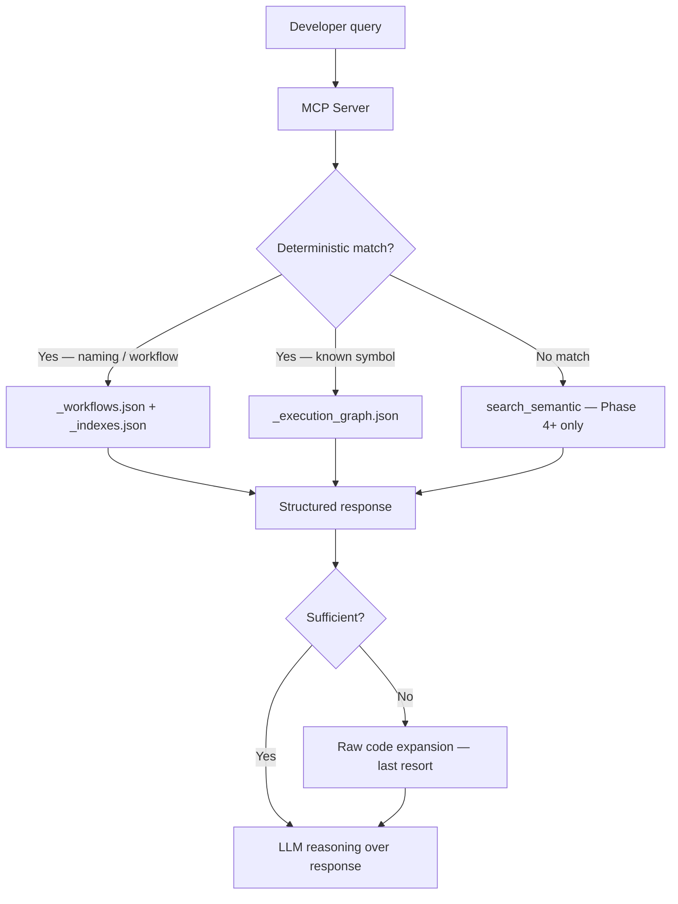
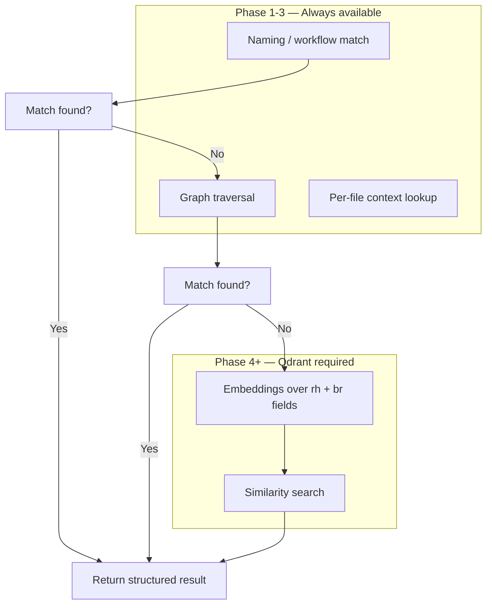
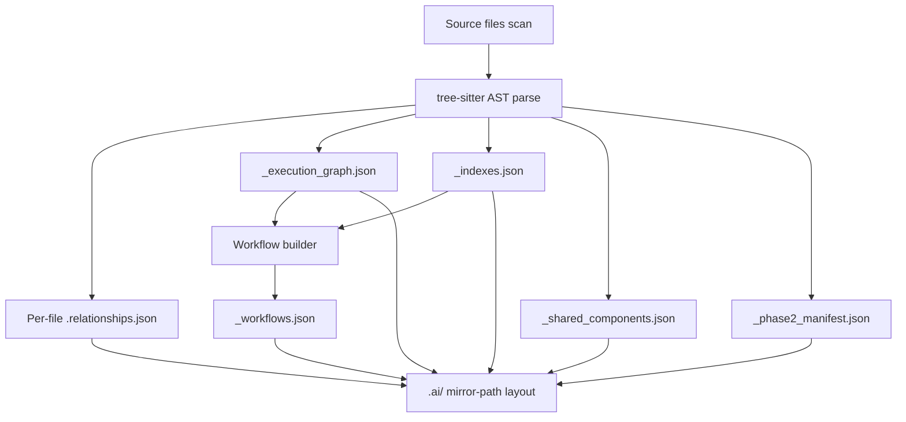
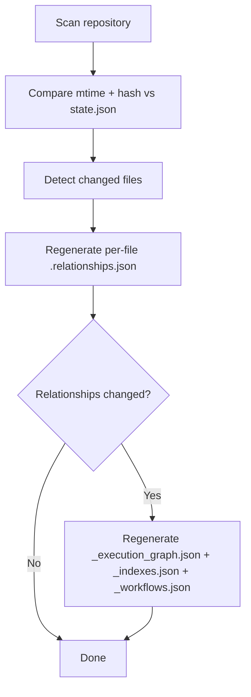
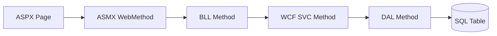

# System Architecture Diagrams

> Last updated: May 2026. Diagrams reflect the Phase 1 + Phase 5 (MCP) architecture.
> Phase 4 (Qdrant / vector search) is deferred — semantic paths are marked accordingly.

---

## 1. End-to-End Query Flow (current — Phase 1 + Phase 5 MCP)

---

## 2. Hybrid Retrieval Priority Order

---

## 3. Phase 1 Scanner — Output Architecture

---

## 4. Incremental Indexing Flow

---

## 5. Execution Chain — Layer Model

Each hop is a typed edge in `_execution_graph.json`. The MCP tool `trace_execution_chain` walks this graph in either direction.
