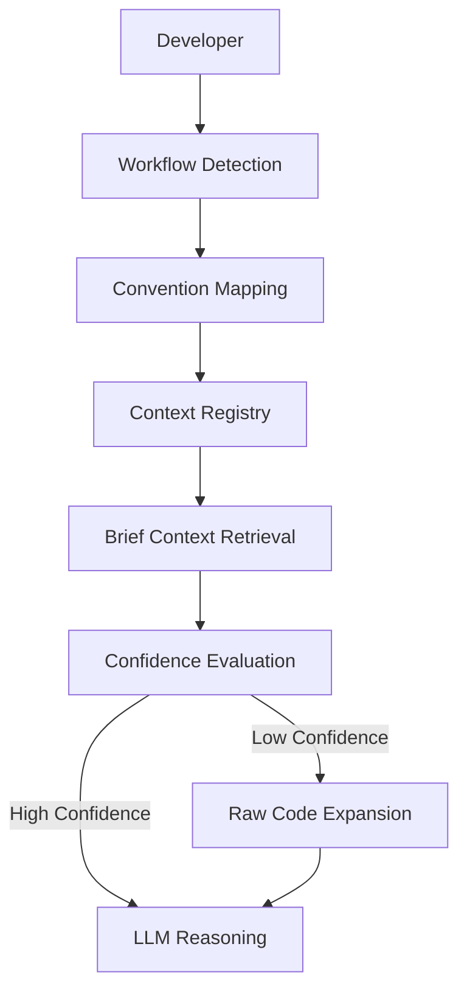
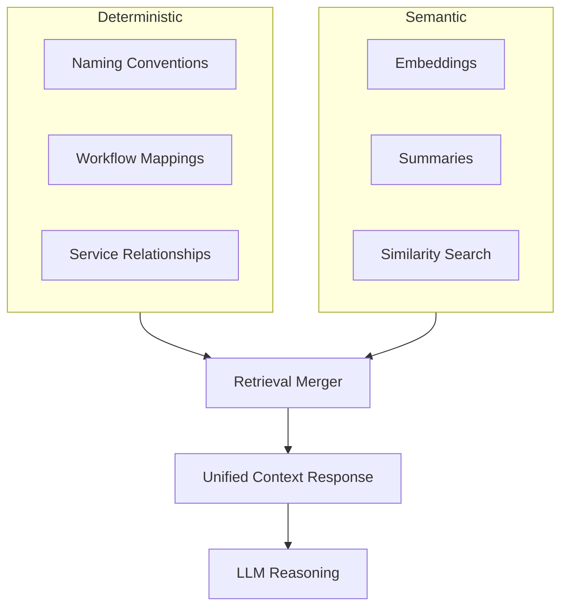
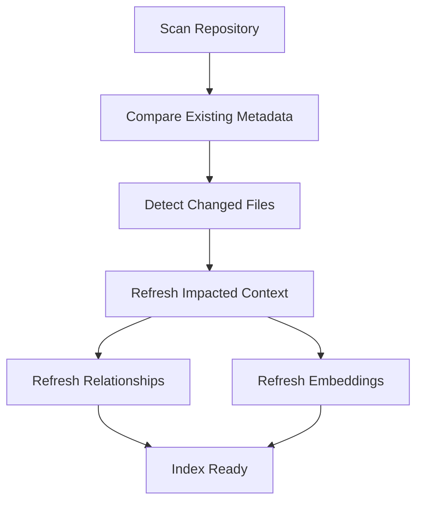

# System Architecture Diagrams

## 1. System Architecture

```mermaid
flowchart TD
    A[Developer] --> B[Workflow Detection]
    B --> C[Convention Mapping]
    C --> D[Context Registry]
    D --> E[Brief Context Retrieval]
    E --> F[Confidence Evaluation]
    F -->|High Confidence| H[LLM Reasoning]
    F -->|Low Confidence| G[Raw Code Expansion]
    G --> H
```

## 2. Hybrid Retrieval Flow

```mermaid
flowchart TD
    subgraph Deterministic
        D1[Naming Conventions]
        D2[Workflow Mappings]
        D3[Service Relationships]
    end

    subgraph Semantic
        S1[Embeddings]
        S2[Summaries]
        S3[Similarity Search]
    end

    Deterministic --> M[Retrieval Merger]
    Semantic --> M
    M --> R[Unified Context Response]
    R --> L[LLM Reasoning]
```

## 3. Incremental Indexing Flow

```mermaid
flowchart TD
    A[Scan Repository] --> B[Compare Existing Metadata]
    B --> C[Detect Changed Files]
    C --> D[Refresh Impacted Context]
    D --> E[Refresh Relationships]
    D --> F[Refresh Embeddings]
    E --> G[Index Ready]
    F --> G
```